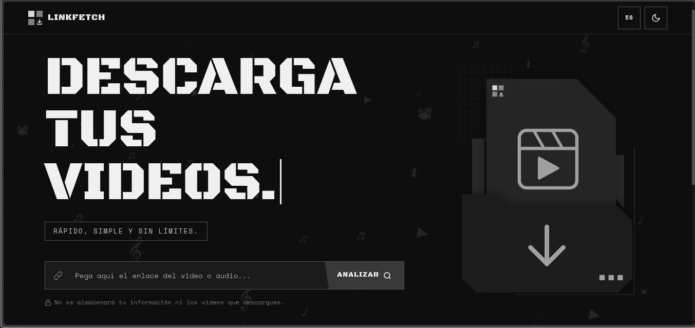
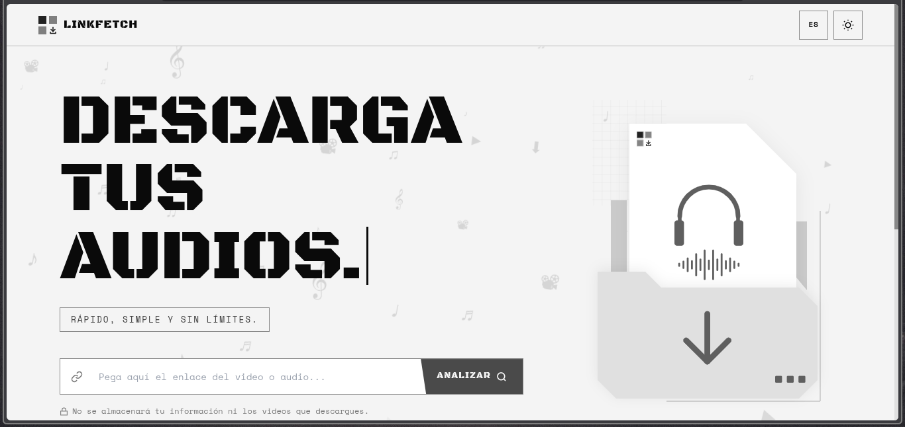
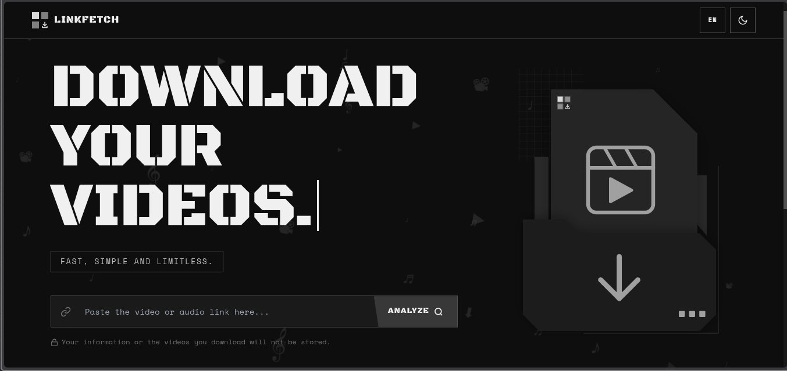
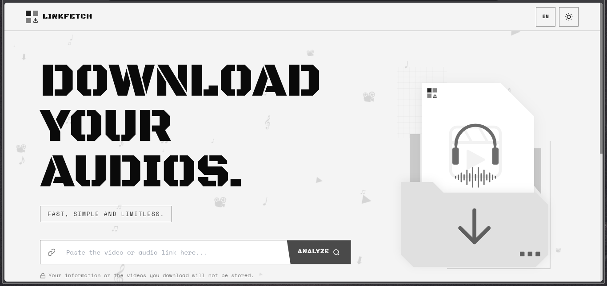

# LINKFETCH

**Descarga videos y audios desde múltiples plataformas en segundos.**

Pega un enlace, elige el formato y descarga. Sin registro, sin límites, sin almacenamiento de datos.

---

## Vista previa de la página web

<table>
  <tr>
    <td align="center"><b>Modo oscuro — Español</b></td>
    <td align="center"><b>Modo claro — Español</b></td>
  </tr>
  <tr>
    <td></td>
    <td></td>
  </tr>
  <tr>
    <td align="center"><b>Modo oscuro — English</b></td>
    <td align="center"><b>Modo claro — English</b></td>
  </tr>
  <tr>
    <td></td>
    <td></td>
  </tr>
</table>

---

## Tecnologías Utilizadas

### Frontend


### Backend


### Procesamiento multimedia


### Seguridad y validación


### Deploy


---

## Características

- **Análisis de contenido** — Detecta automáticamente si el enlace es un video o audio
- **Múltiples formatos** — Descarga en `MP4`, `WEBM`, `MP3` o `WAV`
- **Selección de calidad** — Elige la resolución o bitrate disponible (1080p, 720p, 480p...)
- **6 plataformas soportadas** — YouTube, TikTok, Instagram, X (Twitter), Facebook, SoundCloud
- **Modo oscuro / claro** — Se puede alternar entre los dos temas
- **Bilingüe** — Interfaz disponible en español e inglés
- **Diseño responsive** — Adaptado para móvil, tablet y escritorio
- **Sin almacenamiento** — Los archivos se eliminan del servidor tras la descarga

---

## ¿Cómo funciona?

```
1. Pega el enlace del video o audio en el campo de entrada
2. Haz clic en ANALIZAR
3. Revisa la información del contenido detectado
4. Elige si descargar video o solo el audio
5. Selecciona el formato y la calidad
6. Haz clic en DESCARGAR — el archivo se descarga directamente
```

El frontend envía el enlace al backend, que utiliza **yt-dlp** para extraer la metadata y gestionar la descarga. Si se requiere conversión de formato, **FFmpeg** procesa el archivo antes de enviarlo al cliente. El archivo temporal se elimina del servidor automáticamente al finalizar.

---

## Plataformas soportadas

| Plataforma | Video | Audio |
|------------|-------|-------|
| YouTube | ☑ | ☑ |
| TikTok | ☑ | ☑ |
| Instagram | ☑ | ☑ |
| X (Twitter) | ☑ | ☑ |
| Facebook | ☑ | ☑ |
| SoundCloud | ☒  | ☑ |

---